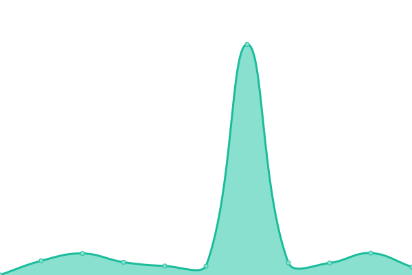
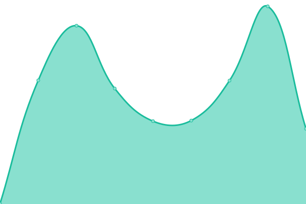
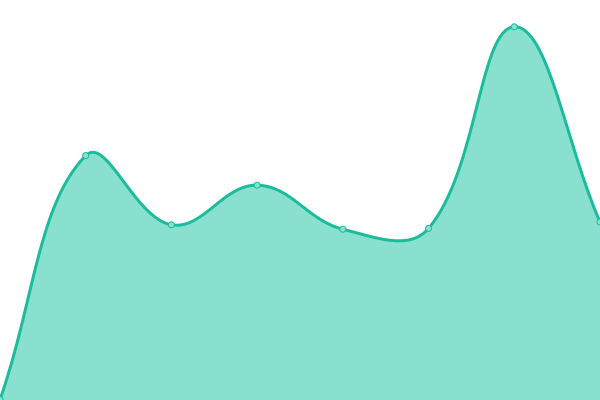
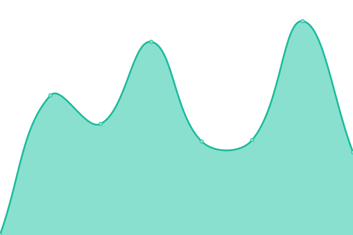
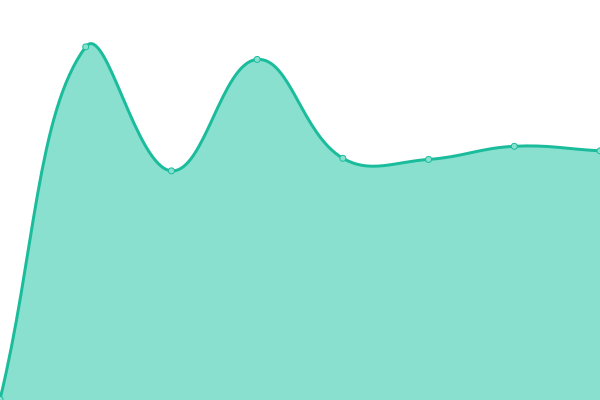

# [📈 Live Status](https://nikolasibalic.github.io/status): <!--live status--> **🟨 Degraded performance**

This repository contains the open-source uptime monitor and status page for [Nikola Šibalić](https://nikolasibalic.github.io), powered by [Upptime](https://github.com/upptime/upptime).

With [Upptime](https://upptime.js.org), you can get your own unlimited and free uptime monitor and status page, powered entirely by a GitHub repository. We use [Issues](https://github.com/nikolasibalic/status/issues) as incident reports, [Actions](https://github.com/nikolasibalic/status/actions) as uptime monitors, and [Pages](https://nikolasibalic.github.io/status) for the status page.

<!--start: status pages-->
<!-- This summary is generated by Upptime (https://github.com/upptime/upptime) -->
<!-- Do not edit this manually, your changes will be overwritten -->
<!-- prettier-ignore -->
| URL | Status | History | Response Time | Uptime |
| --- | ------ | ------- | ------------- | ------ |
|  [Atom Calculator](https://atomcalc.org) | 🟩 Up | [atom-calculator.yml](https://github.com/nikolasibalic/status/commits/HEAD/history/atom-calculator.yml) | 

 805ms
     
 | 

<a href="https://nikolasibalic.github.io/status/history/atom-calculator">100.00%</a>
    

|  [LabBricks](https://labbricks.com) | 🟨 Degraded | [lab-bricks.yml](https://github.com/nikolasibalic/status/commits/HEAD/history/lab-bricks.yml) | 

 2225ms
     
 | 

<a href="https://nikolasibalic.github.io/status/history/lab-bricks">97.73%</a>
    

|  [Science Web Services - QState](https://sws.labbricks.com/qstate/) | 🟨 Degraded | [science-web-services-q-state.yml](https://github.com/nikolasibalic/status/commits/HEAD/history/science-web-services-q-state.yml) | 

 1142ms
     
 | 

<a href="https://nikolasibalic.github.io/status/history/science-web-services-q-state">97.75%</a>
    

|  [ResearchX3D](https://researchx3d.com) | 🟩 Up | [research-x3-d.yml](https://github.com/nikolasibalic/status/commits/HEAD/history/research-x3-d.yml) | 

 2740ms
     
 | 

<a href="https://nikolasibalic.github.io/status/history/research-x3-d">99.77%</a>
    

|  [Carte Event](https://www.carteevent.com/) | 🟩 Up | [carte-event.yml](https://github.com/nikolasibalic/status/commits/HEAD/history/carte-event.yml) | 

 491ms
     
 | 

<a href="https://nikolasibalic.github.io/status/history/carte-event">100.00%</a>
    

|  [Roundtable](https://roundtable.researchx3d.com/) | 🟩 Up | [roundtable.yml](https://github.com/nikolasibalic/status/commits/HEAD/history/roundtable.yml) | 

 462ms
     
 | 

<a href="https://nikolasibalic.github.io/status/history/roundtable">100.00%</a>
    

<!--end: status pages-->

[**Visit our status website →**](https://nikolasibalic.github.io/status)

## 📄 License

- Powered by: [Upptime](https://github.com/upptime/upptime)
- Code: [MIT](./LICENSE) © [Anand Chowdhary](https://anandchowdhary.com), supported by [Pabio](https://pabio.com)
- Data in the `./history` directory: [Open Database License](https://opendatacommons.org/licenses/odbl/1-0/)
